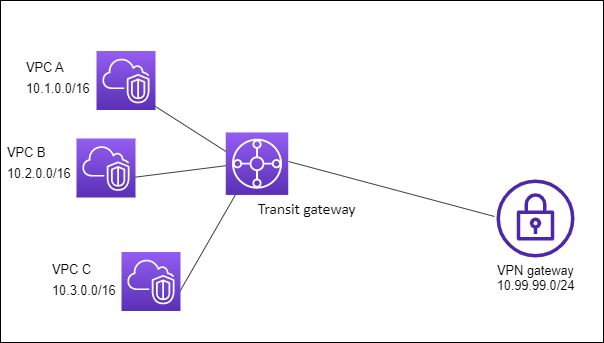

# Example: Isolated VPCs

This example implements:

[ref](https://docs.aws.amazon.com/vpc/latest/tgw/transit-gateway-isolated.html)

# Isolated Routing (from Cantrill's lectures)
https://learn.cantrill.io/courses/1231680/lectures/31664204